<div align="center">

# inventoryquality

### GLPI 11 için Envanter Veri Kalitesi ve Düzeltme Takibi

**Envanterimizde hangi bilgiler güvenilir, hangileri düzeltilmeli — ve bu düzeltmeler gerçekten tamamlandı mı?**

[](https://glpi-project.org)
[](https://www.php.net)
[](CHANGELOG.md)
[](TEST-RAPORU.md)
[](LICENSE)

[Özellikler](#-özellikler) · [Ekranlar](#-ekranlar) · [Nasıl çalışır](#-nasıl-çalışır) · [Kurulum](#-kurulum) · [Kurallar](#-kurallar) · [Düzeltme ve onay](#-düzeltme-ve-onay) · [Testler](#-testler)

<br>

<a href="docs/screenshots/01_genel_bakis.png">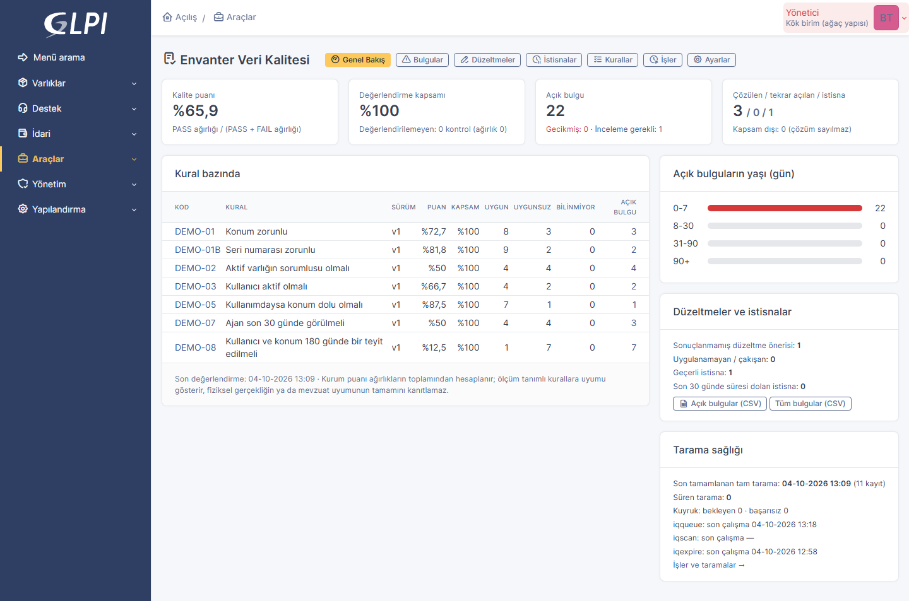</a>

<sub>Genel Bakış — kalite puanı, değerlendirme kapsamı, kural bazında sonuçlar, düzeltme / istisna göstergeleri ve tarama sağlığı</sub>

</div>

<br>

`inventoryquality`, GLPI 11 envanter kayıtlarını kurumun tanımladığı **kalite kurallarına** göre kontrol eden bağımsız bir
eklentidir. Eksik, çelişkili ya da doğrulama süresi geçmiş bilgi için izlenebilir bir **bulgu** açar, işi **sorumluya
atar**, gerekirse tek bir **düzeltme destek kaydında** toplar, düzeltmeyi kurala bağlı **onaydan** geçirir ve bulguyu
**yalnız güncel veride kural yeniden sağlandığında** çözer.

> [!IMPORTANT]
> **Kapanış ilkesi.** "Düzelttim" beyanı, onay verilmesi ya da destek kaydının elle kapatılması bulguyu **tek başına
> çözmez**. Çözüm, güncel verinin ilgili kuralı sağladığını gösteren başarılı bir kontrole dayanır.

<table>
<tr>
<td width="33%" valign="top">

**🔍 Ölçer**<br>
8 hazır kural şablonu, yan etkisiz önizleme, partili ve devam ettirilebilir tarama, açıklanabilir puan + kapsam.

</td>
<td width="33%" valign="top">

**🧭 Yönlendirir**<br>
Tekilleştirilmiş bulgular, otomatik sorumlu atama, varlık + sorumlu başına tek düzeltme destek kaydı.

</td>
<td width="33%" valign="top">

**✅ Doğrular**<br>
Kurala bağlı onay, anlık görüntü ve çakışma kontrolü, atomik yazım, her düzeltmeden sonra yeniden kontrol.

</td>
</tr>
</table>

---

## ✨ Özellikler

| | |
| --- | --- |
| 📏 **Kurallar** | DQ-01 … DQ-08: zorunlu alan, sorumlu, pasif kullanıcı, değer kümesi, koşullu zorunluluk, referans bütünlüğü, güncellik, iş sahibi teyidi. Serbest SQL / PHP / düzenli ifade yok. |
| 🧪 **Önizleme ve sürüm** | Kural yayına alınmadan örnek kayıtlardaki etkisi görülür; her yayın yeni sürümdür, kim ne zaman değiştirdi saklanır. |
| 🗂️ **Kararlı katalog** | Alanlar kararlı anahtarlarla tutulur; alan kaybolur ya da tipi değişirse kural kendiliğinden **askıya** alınır. |
| ⚡ **Olay + tarama** | Kayıt kaydedilince yalnız o kayıt yeniden kontrol edilir; gece tam taraması kaçırılan olayları yakalar. |
| 🧷 **Bulgular** | Aynı sorun tekrar tekrar açılmaz; tekrar eden sorun yeni dönem olur, geçmiş korunur. |
| 👥 **Atama** | Kural → varlığın teknik grubu / sorumlusu → birimin veri kalitesi grubu → "Atama bekliyor". Pasif kişiye iş gitmez. |
| 🎫 **Destek kaydı** | Varlık + sorumlu başına tek kayıt; takip notları; yalnız doğrulanmış çözüm; erken kapanırsa yeni takip kaydı. |
| ✍️ **Düzeltme + onay** | Eklenti içinden öneri, tek / iki sıralı onay, "biri yeterli" / "herkes", kanıt eki, çakışma kontrolü, atomik yazım. |
| ⏸️ **İstisnalar** | Gerekçe, onaylayan, bitiş, telafi edici işlem; süre dolunca otomatik yeniden kontrol. Puanı değiştirmez. |
| 🙋 **İş sahibi teyidi** | Kim, hangi alanları, hangi değerlerle, ne zaman teyit etti — otomatik envanterden ayrı. |
| 📊 **Puan ve kapsam** | Ağırlıklı kalite puanı ile değerlendirme kapsamı birlikte; düşük kapsamda "sağlıklı" denmez. |
| 🔐 **Güvenlik** | 10 ayrı yetki, kurum birimi yalıtımı, CSRF, güvenli CSV, denetim izi (kullanıcı ve servis kimliği ayrı). |

---

## 🖼️ Ekranlar

<table>
<tr>
<td width="50%" valign="top">
<a href="docs/screenshots/02_bulgular.png">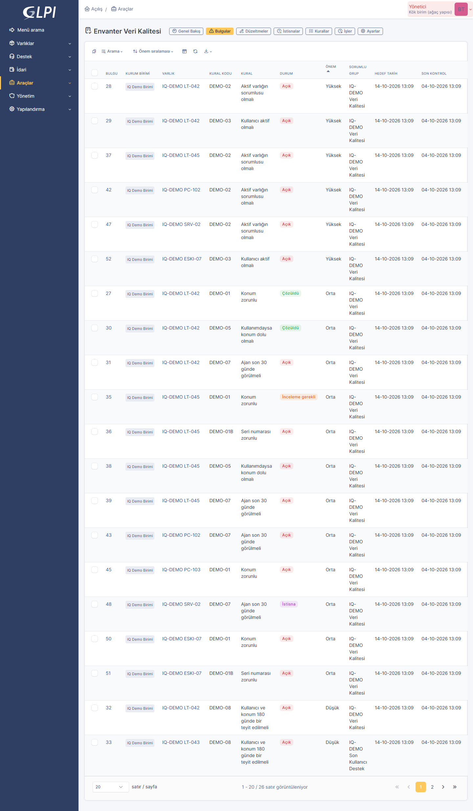</a>
<p align="center"><b>Bulgular</b><br><sub>GLPI arama motoruyla: varlık, kural, durum, önem, sorumlu, hedef tarih</sub></p>
</td>
<td width="50%" valign="top">
<a href="docs/screenshots/03_bulgu_pasif_kullanici.png">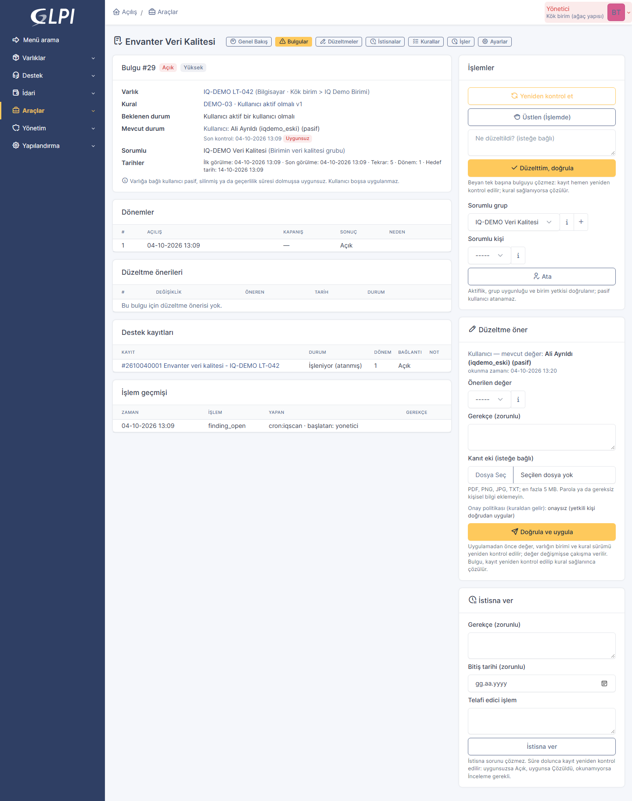</a>
<p align="center"><b>Bulgu detayı</b><br><sub>Beklenen / mevcut durum, dönemler, destek kaydı, öneri ve istisna formları</sub></p>
</td>
</tr>
<tr>
<td width="50%" valign="top">
<a href="docs/screenshots/07_duzeltme_detay.png">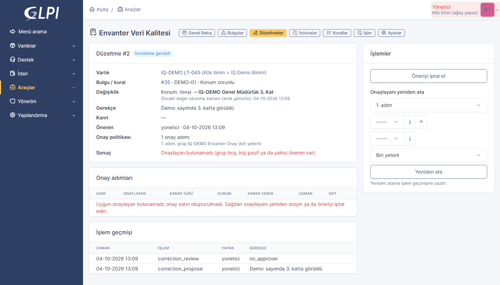</a>
<p align="center"><b>Düzeltme / onay</b><br><sub>Önceki → yeni değer, anlık görüntü, onay adımları, yeniden atama</sub></p>
</td>
<td width="50%" valign="top">
<a href="docs/screenshots/10_kural_formu.png">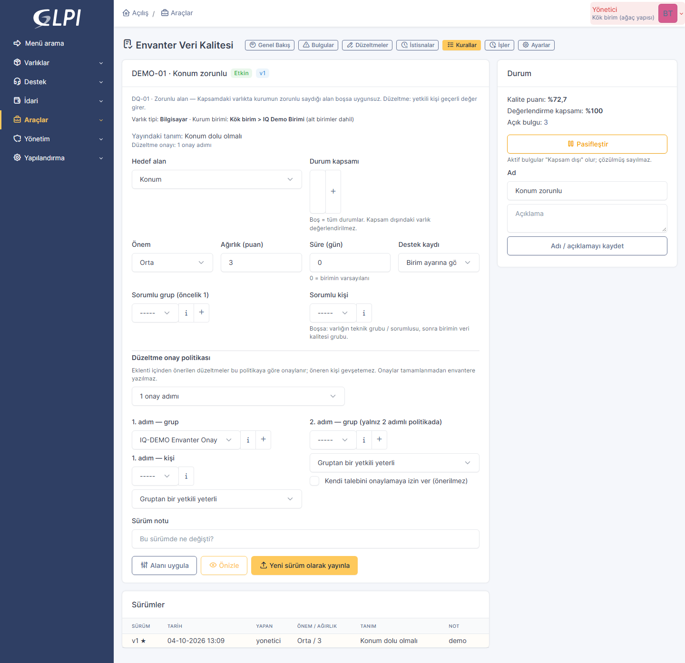</a>
<p align="center"><b>Kural tanımı</b><br><sub>Hedef alan, durum kapsamı, önem, ağırlık, sorumlu, onay politikası, sürümler</sub></p>
</td>
</tr>
<tr>
<td width="50%" valign="top">
<a href="docs/screenshots/13_varlik_sekmesi.png">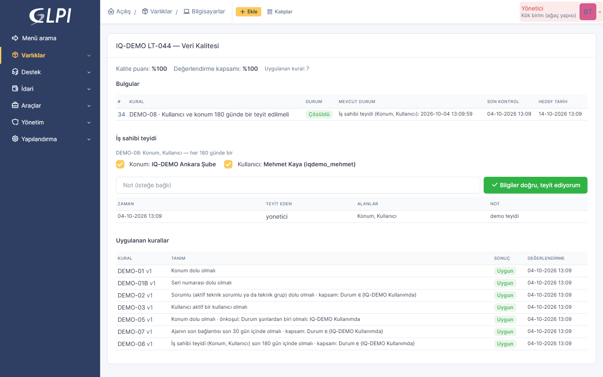</a>
<p align="center"><b>Varlık → Veri Kalitesi</b><br><sub>Varlığın bulguları, iş sahibi teyidi, uygulanan kurallar</sub></p>
</td>
<td width="50%" valign="top">
<a href="docs/screenshots/05_bulgu_istisna.png">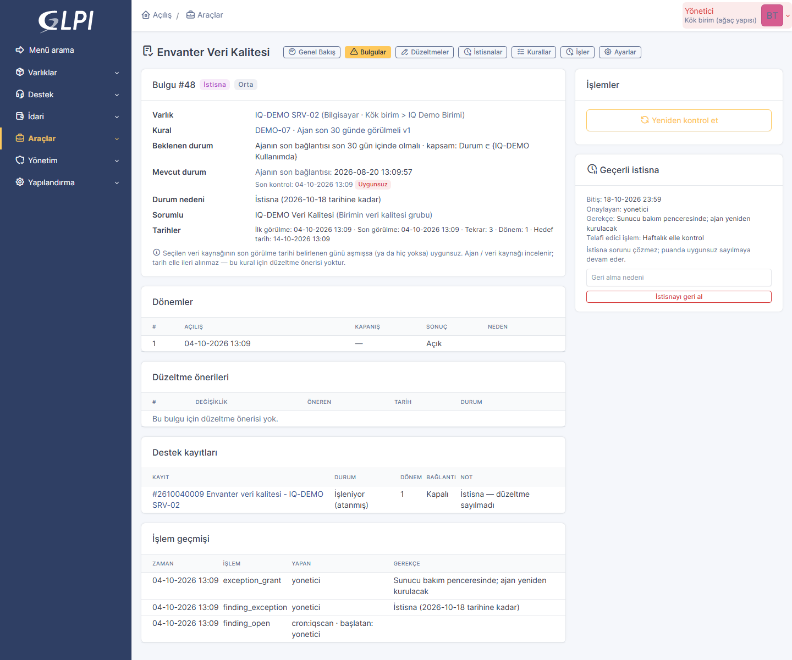</a>
<p align="center"><b>İstisnalı bulgu</b><br><sub>Süreli istisna: gerekçe, onaylayan, bitiş, telafi edici işlem</sub></p>
</td>
</tr>
</table>

<details>
<summary><b>Diğer ekranlar</b> (Düzeltmeler, İstisnalar, Kurallar, İşler, Ayarlar, öneri bekleyen bulgu)</summary>
<br>

| | |
| --- | --- |
| 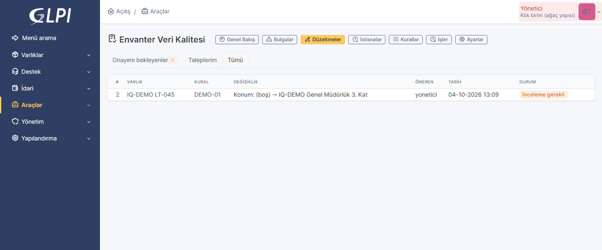<p align="center"><sub>Düzeltmeler — onayımı bekleyenler · taleplerim · tümü</sub></p> | 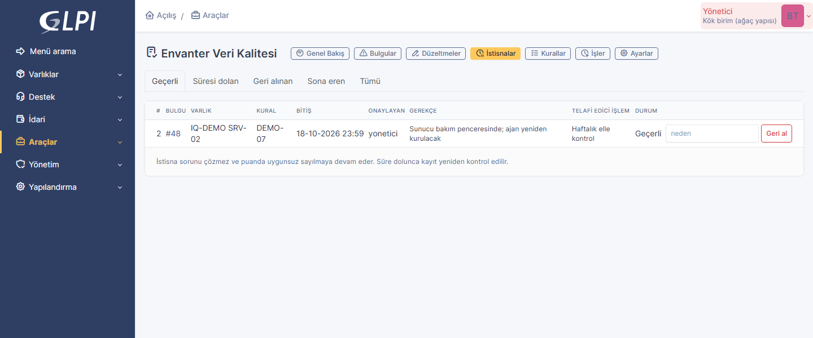<p align="center"><sub>İstisnalar — geçerli / süresi dolan / geri alınan</sub></p> |
| 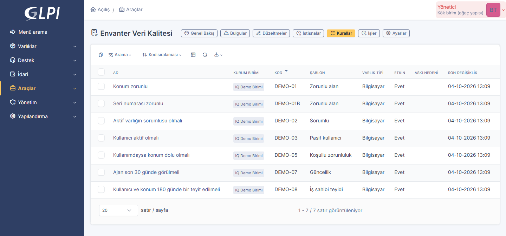<p align="center"><sub>Kurallar — kod, şablon, varlık tipi, durum</sub></p> | 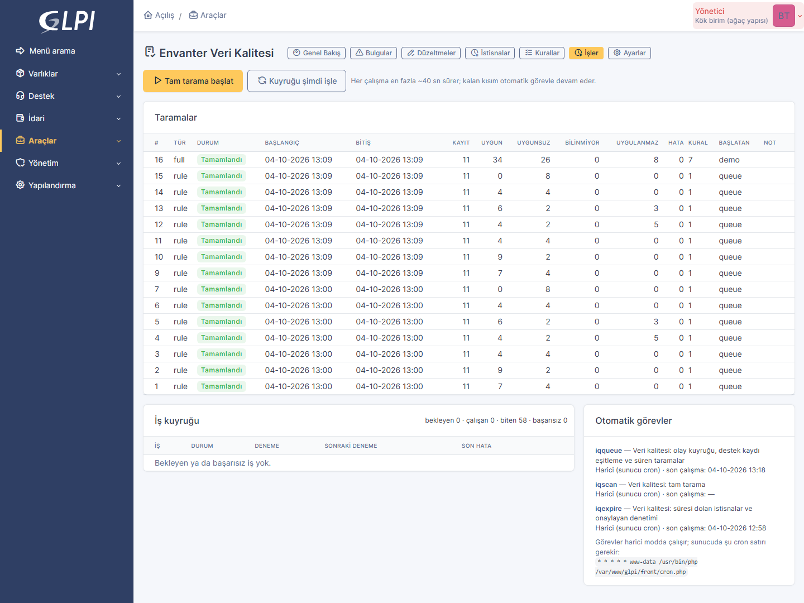<p align="center"><sub>İşler — taramalar, kuyruk, otomatik görevler</sub></p> |
| 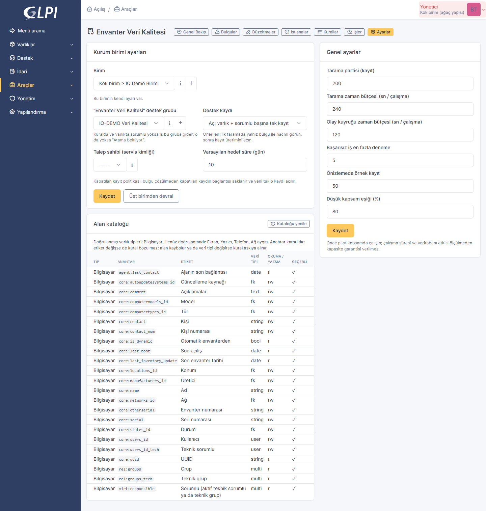<p align="center"><sub>Ayarlar — birim ayarları, genel ayarlar, alan kataloğu</sub></p> | 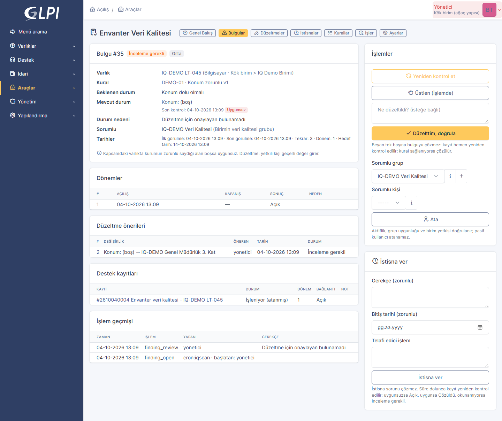<p align="center"><sub>Öneri bekleyen bulgu — onaylayan bulunamadı, İnceleme gerekli</sub></p> |

</details>

<sub>Ekranlar, eklentinin gerçek bir GLPI 11.0.8 kurulumunda "IQ-DEMO" önekli demo verisiyle çekilmiştir.</sub>

---

## 🔄 Nasıl çalışır

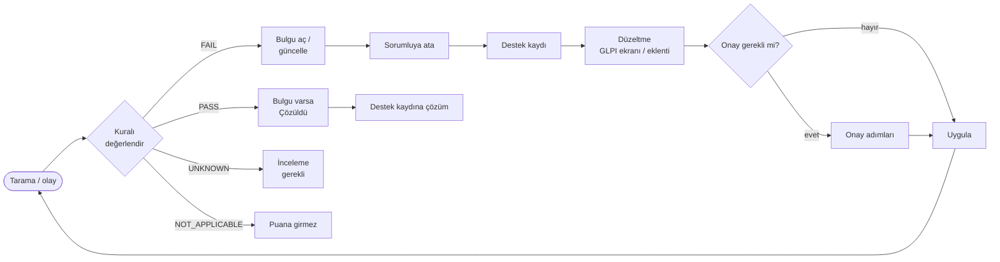

**Örnek senaryo.** `LT-042` adlı bilgisayarın konumu boş ve bağlı kullanıcısı pasif. İki kural uygunsuz çıkar; iki bulgu
açılır ve aynı varlık + aynı sorumlu grup için **tek** düzeltme destek kaydında toplanır. Teknisyen konumu GLPI ekranından
girer; kayıt kendiliğinden yeniden kontrol edilir ve konum bulgusu çözülür. Kullanıcı değişikliği onay gerektiriyorsa
eklentiden önerilir, onaylanınca uygulanır ve yeniden kontrol edilir. İki bulgu da çözülünce destek kaydına çözüm eklenir.

---

## 🚀 Kurulum

> [!NOTE]
> Gereksinimler: GLPI 11.0.x · PHP 8.2+ · MySQL / MariaDB · sunucu cron'u. Başka eklenti gerekmez.

```bash
# 1) Paketi eklenti dizinine açın
sudo tar xzf inventoryquality-0.2.1.tgz -C /var/www/glpi/plugins
sudo chown -R www-data:www-data /var/www/glpi/plugins/inventoryquality

# 2) Kurun ve etkinleştirin
sudo -u www-data php /var/www/glpi/bin/console glpi:plugin:install inventoryquality -u <yönetici>
sudo -u www-data php /var/www/glpi/bin/console glpi:plugin:activate inventoryquality
```

```cron
# 3) Otomatik görevler harici modda çalışır
* * * * * www-data /usr/bin/php /var/www/glpi/front/cron.php
```

Menü: **Araçlar → Envanter Veri Kalitesi** (menünün görünmesi için oturumu kapatıp açın). Kaynak koddan kurmak için depoyu
`plugins/inventoryquality` dizinine klonlayın; `tests/` ve `docs/` gerekmez.

<details>
<summary><b>Kurulum neler yapar?</b></summary>

- 15 tablo oluşturur (`glpi_plugin_inventoryquality_*`, yalnız yoksa),
- yapılandırma güncelleme yetkisi olan profillere tüm eklenti haklarını verir (diğerleri 0),
- üç otomatik görev kaydeder (`iqqueue`, `iqscan`, `iqexpire`),
- alan kataloğunu oluşturur ve kuralları doğrular,
- listelerin varsayılan sütunlarını ekler,
- GLPI'nin derlenmiş şablon önbelleğini temizler (güncellemeden sonra eski ekran görünmesin diye).

</details>

<details>
<summary><b>Güncelleme ve kaldırma</b></summary>

- **Güncelleme:** yeni paketi aynı dizine açın, `glpi:plugin:install` + `glpi:plugin:activate`. Veri korunur, kopya görev
  oluşmaz. **"Kaldır" yapmayın** — tüm veri silinir.
- **Devre dışı bırakma** hiçbir kaydı silmez; olaylar ve otomatik görevler durur.
- **Kaldırma** eklentinin tüm tablolarını, ayarlarını, yetkisini, görevlerini ve kanıt dosyalarını siler. Açılmış GLPI
  destek kayıtları GLPI'de kalır.

</details>

### İlk kullanım — önerilen pilot

1. **Ayarlar → Kurum birimi ayarları:** pilot birim için "Envanter Veri Kalitesi" destek grubunu seçin (destek kaydı modu
   varsayılan olarak **yalnız bulgu**).
2. **Kurallar → Şablondan yeni kural:** şablonu seçin, **Önizle**, **Yeni sürüm olarak yayınla**, **Etkinleştir**.
3. **İşler → Tam tarama başlat.** Sonuçlar **Genel Bakış** ve **Bulgular** ekranlarında.
4. Hacim makulse birimde destek kaydı modunu **Aç** yapın; düzeltme gerektiren kurallara onay politikası tanımlayın.

---

## 📏 Kurallar

| Şablon | Uygunsuzluk koşulu | Düzeltme yaklaşımı |
| --- | --- | --- |
| **DQ-01** Zorunlu alan | Kapsamdaki varlıkta zorunlu alan boş | Yetkili kişi geçerli değer girer |
| **DQ-02** Sorumlu | Aktif varlıkta aktif teknik sorumlu ya da teknik grup yok | Sorumluluk ataması (gerekirse onaylı) |
| **DQ-03** Pasif kullanıcı | Bağlı kullanıcı pasif, silinmiş ya da süresi dolmuş | Geçerli ilişki atanır |
| **DQ-04** Değer kümesi | Alan izin verilen seçeneklerin dışında | Tanımlı seçeneklerden biri seçilir |
| **DQ-05** Koşullu zorunluluk | Önkoşul sağlanınca (ör. "Kullanımda") hedef alan boş | Kapsam koşulu + eksik bilgi birlikte |
| **DQ-06** Referans bütünlüğü | Alan artık bulunmayan bir kayda bağlı | Doğru referans seçilir; tahmin yapılmaz |
| **DQ-07** Güncellik | Veri kaynağının son görülmesi N günü aşmış ya da yok | Ajan / kaynak incelenir; tarih elle ileri alınmaz |
| **DQ-08** İş sahibi teyidi | Seçili alanlar periyotta teyit edilmemiş | İş sahibi teyit verir |

Her kuralın **kararlı kodu**, kapsamı (kurum birimi + alt birimler, varlık tipi, durum), **önemi** (Düşük → Kritik),
**ağırlığı** (1–100), süresi, sorumlusu, destek kaydı politikası ve düzeltme **onay politikası** vardır.

| Sonuç | Anlamı | Puana etkisi |
| --- | --- | --- |
| `PASS` | Uygun | Başarı ve değerlendirilen ağırlığa eklenir |
| `FAIL` | Uygunsuz → bulgu | Değerlendirilen ağırlığa eklenir |
| `UNKNOWN` | Alan okunamadı → İnceleme gerekli | Kapsamı düşürür, başarı sayılmaz |
| `NOT_APPLICABLE` | Önkoşul sağlanmadı | Puana girmez |

<details>
<summary><b>Boşluk kuralı ve operatörler</b></summary>

- Yalnız boşluklardan oluşan metin **boştur**; `"0"` metni, sayısal `0` ve `false` **geçerli** değerdir; açılır listede `0`
  "seçilmemiş" demektir; boş çoklu seçim ayrıca değerlendirilir.
- Operatörler: boş / dolu, eşit / eşit değil, kümede / küme dışında, tarih eşiği (N günden eski / son N gün), bağlı kayıt
  mevcut / aktif.

</details>

---

## 🧷 Bulgu yaşam döngüsü

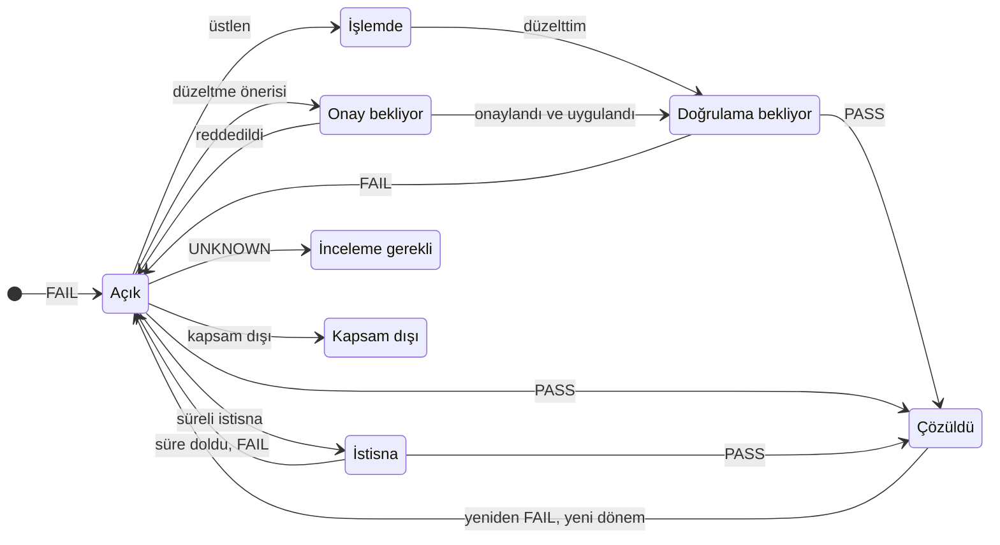

Kararlı anahtar: **kurum birimi + varlık tipi + varlık + kural + hedef alan**. Aynı anahtarda tek güncel bulgu bulunur;
benzersizlik kısıtı eşzamanlı işçilerde bile aynı bulguyu korur. İlk / son görülme, tekrar sayısı ve her dönem saklanır.

---

## ✍️ Düzeltme ve onay

**Üç yol:** GLPI ekranından düzeltme (olay kuyruğu yeniden kontrol eder) · eklenti içinden yetkili düzeltme (onaysız
politikada) · onaylı düzeltme (onaylar tamamlanmadan envantere yazılmaz).

| Onay politikası | Davranış |
| --- | --- |
| Onaysız | "Düzeltme uygula" yetkilisi doğrudan uygular |
| 1 onay adımı | Grup ve/veya kişi |
| 2 sıralı onay adımı | 1. adım tamamlanmadan 2. adım açılmaz |
| Biri yeterli · Belirlenmiş herkes | Gruptan bir yetkili ya da her aktif üye (öneren hariç) |
| Kendi talebini onaylama | Varsayılan **kapalı** |

```text
claimOnce → reloadAssetAndPolicy → checkEntityRightsAndRequiredApprovals
          → validateAllowedFieldsTypesAndReferences → compareTargetFieldsWithSnapshot
          → applyWithVerifiedAdapterAndAudit → enqueueVerificationAndNotifications
          → APPLIED (doğrulama bekliyor)
```

- Öneri anında hedef alanın değeri, varlığın birimi ve kural sürümü **anlık görüntü** olarak saklanır.
- Uygulamada varlık satırı aynı işlemde **kilitlenir**; hedef alan, birim ya da politika değişmişse **CONFLICT** — yazma
  yapılmaz. İlgisiz bir alanın değişmesi çakışma değildir.
- GLPI nesne güncellemesi, GLPI tarihçesi ve denetim kaydı **tek işlemde**; bir adım başarısızsa hepsi geri alınır.
- Ret durumunda (gerekçe zorunlu) envanter değişmez, bulgu açık kalır. Onaylayan bulunamaz ya da pasifleşirse iş
  **İnceleme gerekli**ye düşer; onay otomatik verilmez.

---

## ⏸️ İstisna · 🙋 Teyit · 📊 Puan

<table>
<tr>
<td width="33%" valign="top">

**İstisna**<br>
Gerekçe, onaylayan, bitiş (≤ 365 gün) zorunlu; telafi edici işlem isteğe bağlı. FAIL'i PASS yapmaz. Süre dolunca
saatlik görev yeniden kontrol eder: FAIL → Açık, PASS → Çözüldü, UNKNOWN → İnceleme gerekli.

</td>
<td width="33%" valign="top">

**İş sahibi teyidi**<br>
DQ-08 kuralı seçili alanların periyotta teyit edilmesini ister. Varlık sekmesinden ya da bulgu ekranından verilir; kim,
hangi alanlar, hangi değerler ve ne zaman kaydedilir.

</td>
<td width="33%" valign="top">

**Puan ve kapsam**<br>
`Puan = PASS / (PASS + FAIL)`<br>
`Kapsam = (PASS + FAIL) / (PASS + FAIL + UNKNOWN)`<br>
Ağırlıklarla. Örnek 7 / 3 / 2 → **%70** puan, **%83,3** kapsam.

</td>
</tr>
</table>

---

## 🔐 Yetkiler

**Yönetim → Profiller → Envanter Veri Kalitesi.** Bir işlem yetkisi diğerlerini otomatik vermez; liste, detay, sayaç,
arama, dışa aktarma ve ek indirme **kurum birimi** kısıtından geçer.

| Yetki | İzin verdiği | | Yetki | İzin verdiği |
| --- | --- | --- | --- | --- |
| Görüntüle | Ekranlar, varlık sekmesi | | Düzeltme uygula | Onaysız / onaylı düzeltmeyi uygulama |
| Kural yönet | Kural oluşturma, yayın, etkinleştirme | | Onayla | Onay adımında karar |
| Tarama başlat | Tarama, kuyruk, yeniden kontrol | | İstisna ver | İstisna verme / geri alma |
| İş ata | Elle atama, onaylayanı yeniden atama | | Rapor dışa aktar | Güvenli CSV |
| Düzeltme öner | Eklenti içinden öneri | | Ayar yönet | Ayarlar ekranı |

---

## ⏱️ Otomatik görevler

| Görev | Sıklık | İş |
| --- | --- | --- |
| `iqqueue` | 5 dakika | Olay kuyruğu, destek kaydı eşitleme, süren taramalar |
| `iqscan` | Günde bir (01:00–05:00) | Tam tarama; kaçırılan olayları yakalar |
| `iqexpire` | Saatlik | Süresi dolan istisnalar, pasifleşen onaylayanlar |

Tarama 200 kayıtlık partiler ve zaman bütçesiyle çalışır, kaldığı yeri saklar; yarıda kalan tarama "Kısmi" görünür ve
değerlendirilmeyen bulgular topluca kapatılmaz.

---

## 🛡️ Güvenlik

- Durum değiştiren tüm isteklerde GLPI CSRF koruması; Twig ile otomatik çıktı kaçışlama.
- Değerler GLPI sorgu oluşturucusuyla bağlanır; alan ve tablo seçimi doğrulanmış katalogla sınırlıdır.
- CSV'de `=`, `+`, `-`, `@` ile başlayan hücreler formül olarak yorumlanmasın diye korunur.
- Kanıt dosyaları rastgele adla saklanır; tür içerikten belirlenir; yalnız yetkili ve birim erişimi olana sunulur.
- Sistem işlemleri servis kimliğiyle (`cron:iqscan`, `service:correction` …) kaydedilir; talep eden ve onaylayan ayrıdır.

---

## 🧱 Mimari

<details>
<summary><b>Dosya yapısı</b></summary>

```text
setup.php / hook.php           Eklenti tanımı, menü, yetkiler, olaylar, yaşam döngüsü
src/RuleEvaluator.php          Saf değerlendirici (veri + kural → sonuç)
src/RuleTemplates.php          DQ şablonları, tanım üretimi, onay politikası
src/Catalog.php                Alan kataloğu (keşif, kararlı anahtarlar)
src/AssetAdapter.php           Güncel veriyi normalize okuma
src/ScanRunner.php             Partili tarama, yeniden kontrol, önizleme
src/FindingService.php         Tekilleştirme, dönemler, durum geçişleri
src/AssignmentResolver.php     Sorumlu bulma
src/TicketBridge.php           Destek kaydı oluşturma / bağlama / çözüm
src/CorrectionService.php      Öneri, onay, ret, yeniden atama
src/CorrectionProcessor.php    Güvenli uygulama (kilit, anlık görüntü, atomik yazım)
src/ExceptionService.php       Süreli istisnalar
src/AttestationService.php     İş sahibi teyidi
src/QualityCalculator.php      Puan ve kapsam
src/JobQueue.php · Cron.php    Kuyruk ve otomatik görevler
src/Export.php · Evidence.php  Güvenli CSV, kanıt dosyaları
front/ · templates/            Sayfa denetleyicileri ve Twig ekranları
tests/                         Davranış testleri (pakete dahil değil)
```

</details>

<details>
<summary><b>Veri modeli</b> (önek <code>glpi_plugin_inventoryquality_</code>)</summary>

| Tablo | İçerik |
| --- | --- |
| `rules` · `ruleversions` | Kararlı kural kimliği, kapsam, yayındaki sürüm / tanım |
| `fieldmaps` | Alan kataloğu: anahtar, veri tipi, okuma-yazma, GLPI sürümü |
| `scanruns` · `evaluations` | Taramalar (kaldığı yer, kilit) · varlık × kural güncel sonucu |
| `findings` · `cycles` | Bulgular · açılma–kapanma dönemleri |
| `ticketlinks` | Bulgu ↔ destek kaydı ↔ dönem |
| `corrections` · `approvals` | Öneriler (değişiklik, anlık görüntü, kanıt) · onay adımları |
| `exceptions` · `attestations` | Süreli istisnalar · iş sahibi teyitleri |
| `jobs` · `auditlogs` · `entityconfigs` | İş kuyruğu · denetim izi · birim ayarları |

</details>

---

## 🧪 Testler

Testler ayrı, temiz bir GLPI 11 kurulumunda kendi veritabanıyla koşulur; test verisi oluşturulur ve sonda silinir.
Ayrıntı: [`tests/README.md`](tests/README.md) · sonuçlar: [`TEST-RAPORU.md`](TEST-RAPORU.md).

| Test grubu | Kontrol |
| --- | ---: |
| Motor — kural, tarama, bulgu, atama, destek kaydı, puan, birim yalıtımı | 55 |
| Ekranlar — gerçek sayfa dosyaları, yetki ve birim yalıtımı | 38 |
| Otomatik görevler — GLPI'nin gerçek `front/cron.php` çalıştırıcısı | 6 |
| 3. aşama motor — onay, çakışma, atomiklik, istisna, DQ-07/08, CSV, kanıt | 60 |
| 3. aşama ekranlar — farklı kullanıcılarla | 26 |
| **Toplam** | **185 / 185** |

> [!CAUTION]
> Test betikleri veri oluşturur ve siler. **Gerçek veri içeren bir GLPI'de çalıştırmayın.**

---

## 🗺️ Yol haritası

- [x] Kural motoru, tarama, bulgular, atama, destek kaydı, puan (0.1.0)
- [x] Düzeltme + onay, istisna, DQ-07 / DQ-08, güvenli CSV, kanıt eki (0.2.0)
- [x] Varsayılan liste sütunları, ekran düzeltmeleri (0.2.1)
- [ ] Monitor, Printer, Phone, NetworkEquipment adaptörleri
- [ ] Fields eklentisi ve GLPI 11 özel varlık adaptörleri
- [ ] Native Forms ile düzeltme önerisi
- [ ] Gerçek oturumlu tarayıcı test paketi

---

## ❓ Sık sorulanlar

<details>
<summary><b>Bulguyu neden elle kapatamıyorum?</b></summary>
<br>
Kapanış ilkesi gereği bulgu yalnız güncel veride kural sağlanınca çözülür. Veriyi düzeltip "Yeniden kontrol et"e basın ya
da birkaç dakika bekleyin.
</details>

<details>
<summary><b>Destek kaydı neden açılmadı?</b></summary>
<br>
Birim "yalnız bulgu" modunda olabilir, kuralda destek kaydı kapalı olabilir ya da bulgu "Atama bekliyor" durumundadır.
</details>

<details>
<summary><b>Yeni oluşturduğum birimdeki veriler görünmüyor.</b></summary>
<br>
GLPI görülebilen birimleri oturum açarken belirler. Oturumu kapatıp açın ya da birim seçiminde ağaç yapısını seçin.
</details>

<details>
<summary><b>Güncellemeden sonra ekranlar eski görünüyor.</b></summary>
<br>
Kurulum şablon önbelleğini temizler; yine de görünüyorsa <code>php bin/console cache:clear</code> çalıştırın.
</details>

<details>
<summary><b>Görevler çalışmıyor.</b></summary>
<br>
Görevler harici moddadır; sunucuda GLPI cron satırının olduğundan emin olun (<b>Kurulum → Otomatik İşlemler</b>).
</details>

---

<div align="center">

**inventoryquality** · Pınar Topuz · [GPLv3+](LICENSE)

<sub>Değişiklikler: <a href="CHANGELOG.md">CHANGELOG.md</a> · Test raporu: <a href="TEST-RAPORU.md">TEST-RAPORU.md</a></sub>

</div>
